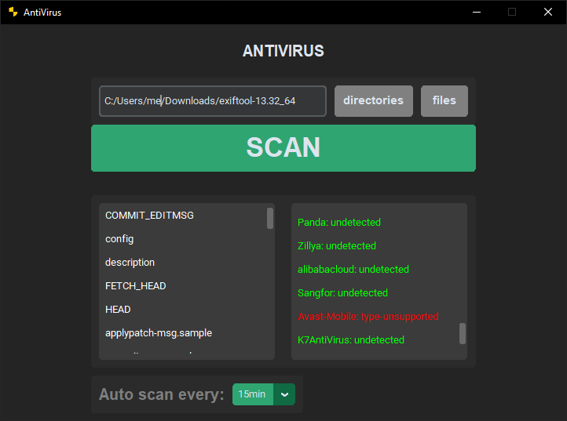
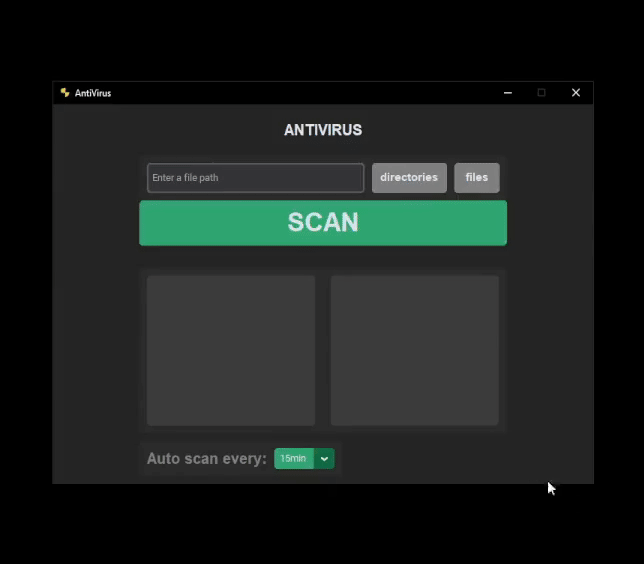
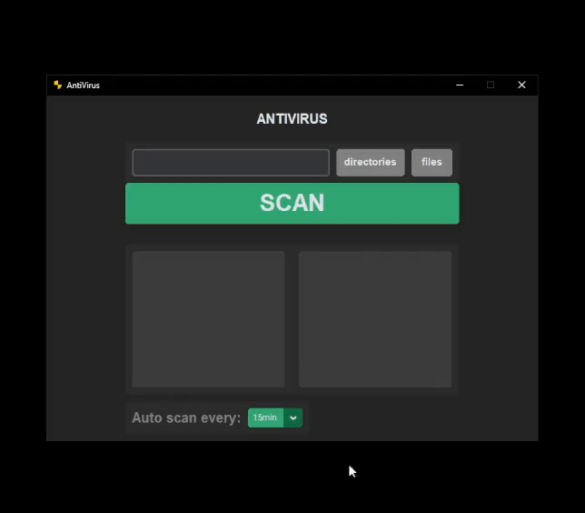

# 🛡️ AntiVirus App

A simple tool that ustilizes the [VirusTotal API](https://docs.virustotal.com/reference/overview) to run a file on your computer through **multiple AV engines** and run recurring background scans on newly downloaded files.

## 🖼️ Screenshot

### used in project:
- `VirusTotal API`
- `Custom Tkinter`

## 🧰 Features

- Scan **files** or **directories** for threats

    > Displays **scan results** from multiple antivirus engines 

    

- **Auto-scan** mode with selectable intervals

    >- detects new files in the Downloads folder and adds them to a list of paths.
    >- checks the list of paths and clears it once every {decided interval}.

    

    ### * importent!! - Leave the app running for detection of new files

